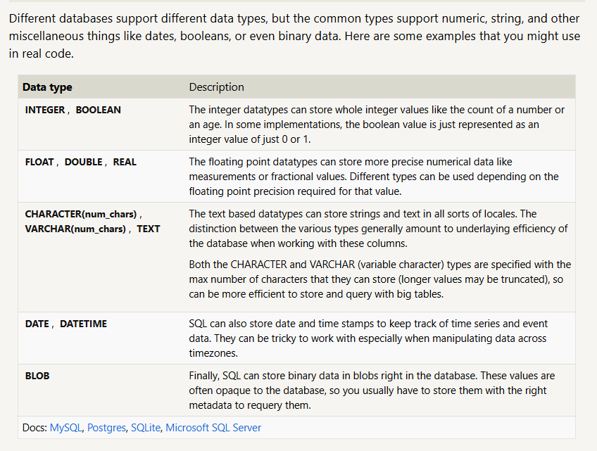
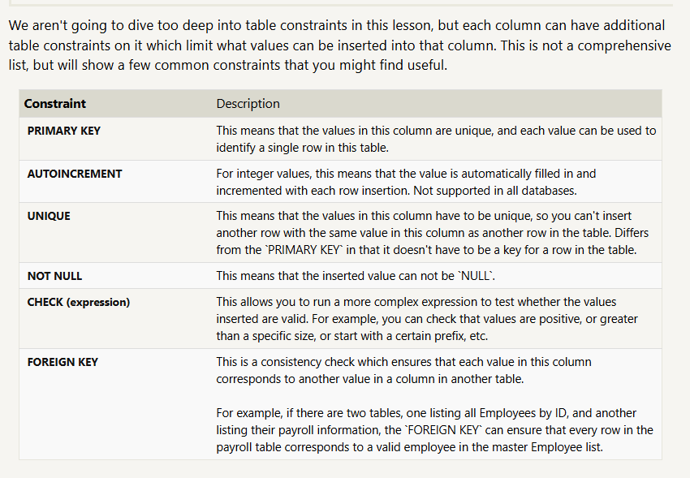

## SQL Lesson 1: SELECT queries 101

1. Find the title of each film 
    ```sql
    SELECT title 
    FROM movies;
    ```
2. Find the director of each film
    ```sql
    SELECT title 
    FROM movies;
    ```
3. Find the title and director of each film
    ```sql
    SELECT title 
    FROM movies;
    ```
4. Find the title and year of each film
    ```sql 
    SELECT title,year
    FROM movies;
    ```
5. Find all the information about each film
    ```sql
    SELECT *
    FROM movies;
    ```
## SQL Lesson 2: Queries with constraints (Pt. 1)

1. Find the movie with a row id of 6
   ```sql
    SELECT * 
    FROM movies
    WHERE id = 6;
    ```
1. Find the movies released in the years between 2000 and 2010
    ```sql
    SELECT * 
    FROM movies
    Where Year
    BETWEEN 2000 AND 2010;
    ```
2. Find the movies not released in the years between 2000 and 2010
    ```sql
    SELECT * 
    FROM movies
    Where Year
    NOT BETWEEN 2000 AND 2010;
    ```
3. Find the first 5 Pixar movies and their release year
   ```sql
    SELECT title, year 
    FROM Movies
    WHERE id 
    BETWEEN 1 AND 5;
   ```

## SQL Lesson 3: Queries with constraints (Pt. 2)
   
1. Find all the movies directed by John Lasseter
   ```sql
    SELECT * 
    FROM Movies
    WHERE Title LIKE "Toy Story%";
   ```
2. Find all the Toy Story movies
   ```sql
    SELECT * 
    FROM Movies
    WHERE director = "John Lasseter";
   ```
3. Find all the movies (and director) not directed by John Lasseter
    ```sql
    SELECT Title, director 
    FROM Movies
    WHERE director NOT Like "John Lasseter";
    ```
4. Find all the WALL-* movies
   ```sql
    SELECT *
    FROM Movies
    WHERE title like "WALL-%";
   ```
## SQL Lesson 4: Filtering and sorting Query results


1. List all directors of Pixar movies (alphabetically), without duplicates
    ```sql
    SELECT distinct director 
    FROM movies 
    Order By Director;
    ```
1. List the last four Pixar movies released (ordered from most recent to least)
    ```sql
    SELECT *
    FROM movies 
    Order By year DESC
    limit 4;
    ```
1. List the first five Pixar movies sorted alphabetically
    ```sql
    SELECT *
    FROM movies 
    Order By title ASC
    limit 5;
    ```
1. List the next five Pixar movies sorted alphabetically
    ```sql
    SELECT *
    FROM movies 
    Order By title ASC
    limit 5 OFFSET 5;
    ```
## SQL Review: Simple SELECT Queries
1. List all the Canadian cities and their populations ✓
   ```sql
   SELECT * 
    FROM north_american_cities
    WHERE country = "Canada";
   ```
2. Order all the cities in the United States by their latitude from north to south
   ```sql
   SELECT * 
    FROM north_american_cities
    WHERE Country = "United States"
    ORDER BY Latitude DESC;
   ```
3. List all the cities west of Chicago, ordered from west to east
    ```sql
    SELECT * 
    FROM north_american_cities
    WHERE longitude < (
        SELECT longitude
        FROM north_american_cities
        where city = "Chicago"
    )
    ORDER BY longitude ASC;
    ```
4. List the two largest cities in Mexico (by population)
    ```sql
    SELECT Population
    FROM north_american_cities
    WHERE country = "Mexico"
    ORDER BY Population Desc
    limit 2;
    ```
5. List the third and fourth largest cities (by population) in the United States and their population
   ```sql
    SELECT city
    FROM north_american_cities
    WHERE country = "United States"
    ORDER BY Population Desc
    limit 2 OFFSET 2;
   ```

## Normalization

### First Normal form rules


# First Normal Form (1NF)

## Definition

First Normal Form (1NF) is the first stage of database normalization. A table is in 1NF if all attributes contain only atomic (single, indivisible) values and each record is uniquely identifiable.

## Rules of First Normal Form

### 1. Each Cell Must Contain a Single Value

Every column must contain only one value for each row. Multiple values stored in a single cell are not allowed.

**Not in 1NF**

| StudentID | Name | Subjects |
|------------|------|----------|
| 101 | John | Math, Science |

**In 1NF**

| StudentID | Name | Subject |
|------------|------|---------|
| 101 | John | Math |
| 101 | John | Science |

---

### 2. No Repeating Groups

A table must not contain repeating columns such as Subject1, Subject2, Subject3, etc.

**Not in 1NF**

| StudentID | Subject1 | Subject2 |
|------------|----------|----------|
| 101 | Math | Science |

**In 1NF**

| StudentID | Subject |
|------------|---------|
| 101 | Math |
| 101 | Science |

---

### 3. Each Row Must Be Unique

Every row in the table must be uniquely identifiable using a primary key or a combination of columns (composite key).

**Example**

| StudentID | Subject |
|------------|---------|
| 101 | Math |
| 101 | Science |

In this case, the combination of **StudentID** and **Subject** can serve as a composite key.

---

### 4. Columns Must Store Values of the Same Type

Each column should contain values belonging to the same domain or data type.

**Example**

| EmployeeID | EmployeeName | Salary |
|------------|--------------|--------|
| E001 | Sarah | 50000 |
| E002 | Tom | 45000 |

The **Salary** column contains only numeric values.

---

## Characteristics of a 1NF Table

A table is in First Normal Form when:

- Each cell contains a single, atomic value.
- There are no repeating groups or multivalued attributes.
- Every row is unique.
- Each column represents a single attribute.
- Each column contains values from the same domain.

---

## Example of a Table in 1NF

| EmployeeID | EmployeeName | Skill |
|------------|--------------|--------|
| E001 | Sarah | SQL |
| E001 | Sarah | Python |
| E002 | Tom | Excel |

### Why This Table Is in 1NF

- Each cell contains only one value.
- No repeating groups exist.
- Skills are stored as separate rows rather than multiple values in one cell.
- The combination of `EmployeeID` and `Skill` can uniquely identify each record.

## Summary

First Normal Form (1NF) ensures that:

1. Data is stored in atomic values.
2. Repeating groups are removed.
3. Each row is uniquely identifiable.
4. Columns contain a single type of information.

1NF provides the foundation for higher levels of normalization such as Second Normal Form (2NF) and Third Normal Form (3NF).

## SQL Lesson 6: Multi-table queries with JOINs
1. Find the domestic and international sales for each movie ✓
```sql
    SELECT m.title, b.domestic_sales,b.international_sales
    From movies as m
    Inner Join boxoffice as b
    On m.id = b.movie_id;
```
2. Show the sales numbers for each movie that did better internationally rather than domestically
```sql
    SELECT m.title, b.domestic_sales,b.international_sales
    From movies as m
    Inner Join boxoffice as b
    On m.id = b.movie_id
    Where b.international_sales > b.domestic_sales;
```
3. List all the movies by their ratings in descending order
```sql
    SELECT m.title
    From movies as m
    Inner Join boxoffice as b
    On m.id = b.movie_id
    Order By b.rating DESC;
```

## SQL Lesson 7: OUTER JOINs

1. Find the list of all buildings that have employees
```sql
    Select Distinct building
    From employees;
```
2. Find the list of all buildings and their capacity
```sql
    Select *
    From buildings;
```
3. List all buildings and the distinct employee roles in each building (including empty buildings)
```sql
    Select Distinct b.building_name, e.role
    From buildings as b
    Left Join  employees as e
    On e.building =  b.building_name;
```

## SQL Lesson 8: A short note on NULLs
1. Find the name and role of all employees who have not been assigned to a building ✓
```sql
    SQL Lesson 8: A short note on NULLs
```
2. Find the names of the buildings that hold no employees
```sql
    SELECT b.Building_name 
    FROM buildings as b
    Left Join employees as e
    On b.building_name = e.building
    Where building is null;
```
## Lesson 9: Queries with expressions
1. List all movies and their combined sales in millions of dollars ✓
```sql
    SELECT *,
        (b.domestic_sales + b.international_sales) / 1000000 AS combined_sales
    FROM movies as m
    LEFT JOIN boxoffice as b
        ON m.id = b.movie_id;
```
2. List all movies and their ratings in percent 
```sql
    SELECT *, (Rating * 10) as New_Rating
    FROM movies as m
    LEFT JOIN boxoffice as b
        ON m.id = b.movie_id;
```
3. List all movies that were released on even number years
```sql
    SELECT *
    FROM movies as m
    LEFT JOIN boxoffice as b
        ON m.id = b.movie_id
    Where (m.year %2) = 0;
```
## SQL Lesson 10: Queries with aggregates (Pt. 1)

We use Group by key word when we want to drill down on a specific column, specifically when we want "each"
1. Find the longest time that an employee has been at the studio ✓
```sql
    SELECT name,role, max(years_employed) 
    FROM employees;
```
2. For each role, find the average number of years employed by employees in that role
```sql
    SELECT Role,Name,Avg(years_employed) as Average_Years_Employed
    FROM employees
    Group By role;
```
3. Find the total number of employee years worked in each building
```sql
    SELECT *,Sum(years_employed) as Total_Years_Employed
    FROM employees
    Group By building;
```

## SQL Lesson 11: Queries with aggregates (Pt. 2)
1. Find the number of Artists in the studio (without a HAVING clause) ✓
```sql
   SELECT role, count(role)
   FROM employees
   Where role = "Artist";
```
2. Find the number of Employees of each role in the studio
```sql
    SELECT role, count(role)
    FROM employees
    Group By role;
```
3. Find the total number of years employed by all Engineers
```sql
    SELECT role, sum(years_employed)
    FROM employees
    Where role like "Engineer";
```

## SQL Lesson 12: Order of execution of a Query

1. Find the number of movies each director has directed
   ```sql
   SELECT director, count(title)
   FROM movies
   Group by director
   Order by count(title) desc;
   ```
2. Find the total domestic and international sales that can be attributed to each director
   ```sql
   SELECT Director, SUM(domestic_sales + international_sales)
   FROM movies as m
   Inner Join boxoffice as b
   On m.id = b.movie_id
   Group by director;
   ```

## SQL Lesson 13: Inserting rows
1. Add the studio's new production, Toy Story 4 to the list of movies (you can use any director)
```sql
    INSERT INTO Movies
    VALUES (4,'Toy Story 4','Murangi', 2026, 120);
```
2. Toy Story 4 has been released to critical acclaim! It had a rating of 8.7, and made 340 million domestically and 270 million internationally. Add the record to the BoxOffice table.
```sql
    INSERT INTO Boxoffice
    (Movie_id, Rating, Domestic_sales, International_sales)
    VALUES (4, 8.7,270000000,340000000);
```
## SQL Lesson 14: Updating rows
1. The director for A Bug's Life is incorrect, it was actually directed by John Lasseter
```sql
    UPDATE movies
    SET director = 'John Lasseter'
    WHERE title = 'A Bug''s Life';
```
1. The year that Toy Story 2 was released is incorrect, it was actually released in 1999
```sql
    UPDATE movies
    SET year = 1999
    WHERE title = 'Toy Story 2';
```
1. Both the title and director for Toy Story 8 is incorrect! The title should be "Toy Story 3" and it was directed by Lee Unkrich
```sql
    UPDATE movies
    SET title = 'Toy Story 8'
    WHERE title = 'Toy Story 8', dirctor = 'Lee Unkrich';
```
## SQL Lesson 15: Deleting rows

1. This database is getting too big, lets remove all movies that were released before 2005.
```sql
    DELETE FROM movies
    WHERE year < 2005;
```
2. Andrew Stanton has also left the studio, so please remove all movies directed by him.
```sql
    Delete from movies
    Where director = 'Andrew Stanton';
```
## SQL Lesson 16: Creating tables

### Table data types


### Table constraints


Create a new table named Database with the following columns:
– Name A string (text) describing the name of the database
– Version A number (floating point) of the latest version of this database
– Download_count An integer count of the number of times this database was downloaded

This table has no constraints.


```sql
    CREATE TABLE Database (
        Name Text ,
        Version Float,
        Download_count Integer
    );
```
## SQL Lesson 16: Creating tables
1. Add a column named Aspect_ratio with a FLOAT data type to store the aspect-ratio each movie was released in. ✓
```sql

    ALTER TABLE Movies
    ADD Aspect_Ratio Float  
    DEFAULT Null;
```
2. Add another column named Language with a TEXT data type to store the language that the movie was released in. Ensure that the default for this language is English.
```sql
    ALTER TABLE Movies
    ADD Language Text  
    DEFAULT 'English';
```

## SQL Lesson 18: Dropping tables
1. We've sadly reached the end of our lessons, lets clean up by removing the Movies table
```sql
    DROP TABLE IF EXISTS Movies;
```
2. And drop the BoxOffice table as well
```sql
    DROP TABLE IF EXISTS Boxoffice;
```