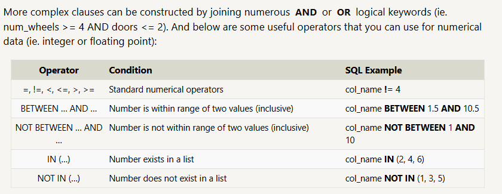
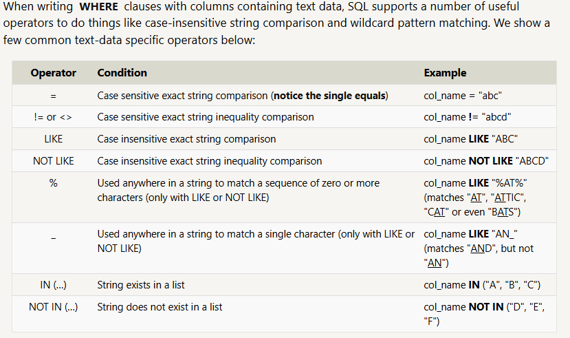
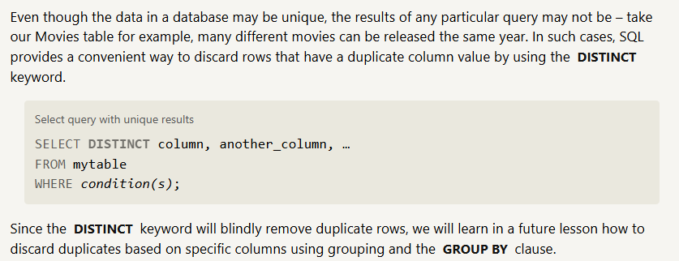
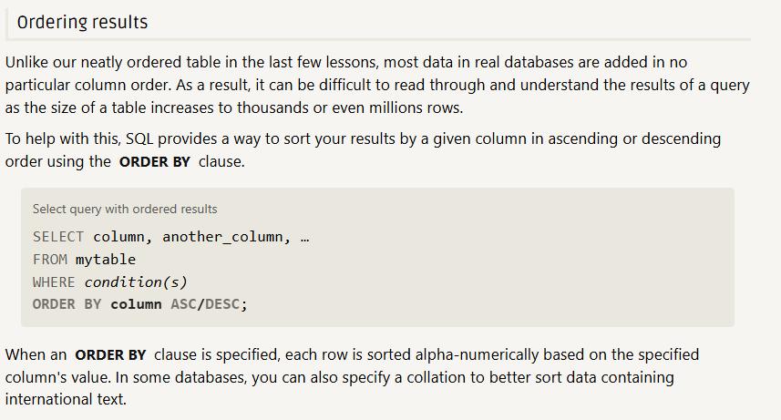
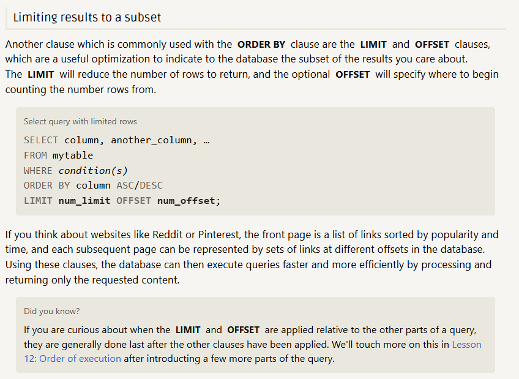

## SQL Lesson 1: SELECT queries 101

1. Find the title of each film 
    ```sql
    SELECT title 
    FROM movies;
    ```
2. Find the director of each film
    ```sql
    SELECT title 
    FROM movies;
    ```
3. Find the title and director of each film
    ```sql
    SELECT title 
    FROM movies;
    ```
4. Find the title and year of each film
    ```sql 
    SELECT title,year
    FROM movies;
    ```
5. Find all the information about each film
    ```sql
    SELECT *
    FROM movies;
    ```
## SQL Lesson 2: Queries with constraints (Pt. 1)

1. Find the movie with a row id of 6
   ```sql
    SELECT * 
    FROM movies
    WHERE id = 6;
    ```
1. Find the movies released in the years between 2000 and 2010
    ```sql
    SELECT * 
    FROM movies
    Where Year
    BETWEEN 2000 AND 2010;
    ```
2. Find the movies not released in the years between 2000 and 2010
    ```sql
    SELECT * 
    FROM movies
    Where Year
    NOT BETWEEN 2000 AND 2010;
    ```
3. Find the first 5 Pixar movies and their release year
   ```sql
    SELECT title, year 
    FROM Movies
    WHERE id 
    BETWEEN 1 AND 5;
   ```

## SQL Lesson 3: Queries with constraints (Pt. 2)
   
1. Find all the movies directed by John Lasseter
   ```sql
    SELECT * 
    FROM Movies
    WHERE Title LIKE "Toy Story%";
   ```
2. Find all the Toy Story movies
   ```sql
    SELECT * 
    FROM Movies
    WHERE director = "John Lasseter";
   ```
3. Find all the movies (and director) not directed by John Lasseter
    ```sql
    SELECT Title, director 
    FROM Movies
    WHERE director NOT Like "John Lasseter";
    ```
4. Find all the WALL-* movies
   ```sql
    SELECT *
    FROM Movies
    WHERE title like "WALL-%";
   ```
## SQL Lesson 4: Filtering and sorting Query results




1. List all directors of Pixar movies (alphabetically), without duplicates
    ```sql
    SELECT distinct director 
    FROM movies 
    Order By Director;
    ```
1. List the last four Pixar movies released (ordered from most recent to least)
    ```sql
    SELECT *
    FROM movies 
    Order By year DESC
    limit 4;
    ```
1. List the first five Pixar movies sorted alphabetically
    ```sql
    SELECT *
    FROM movies 
    Order By title ASC
    limit 5;
    ```
1. List the next five Pixar movies sorted alphabetically
    ```sql
    SELECT *
    FROM movies 
    Order By title ASC
    limit 5 OFFSET 5;
    ```
    